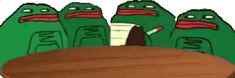

# DSTU_VMO
Лабораторные работы по предметам:
1. Языки программирования (Python -  1-2 курс)
2. Теория информации и кодирования (Python - 2 курс)
3. Теория автоматов и формальных языков (Python - 2 курс)
4. Структуры и алгоритмы компьютерных обработки данных (Python - 2 курс)
5. Объектно-ориентированное программирование (С++ - 2 курс)
6. 

---

